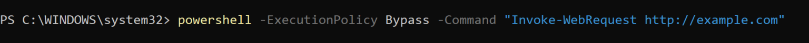
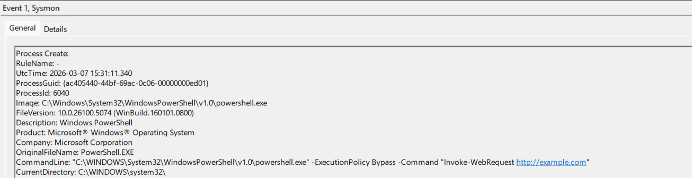
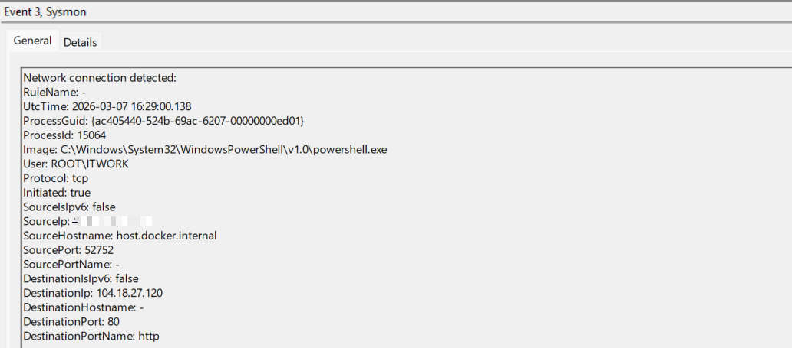
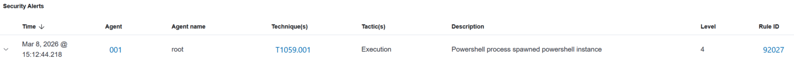
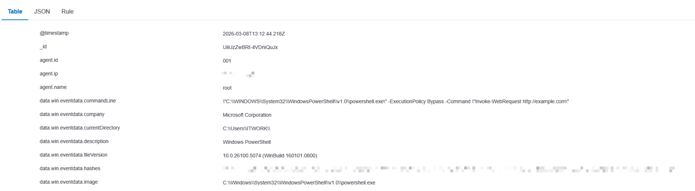
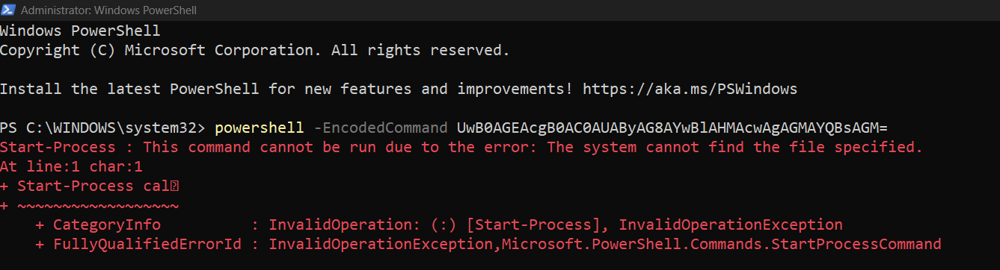
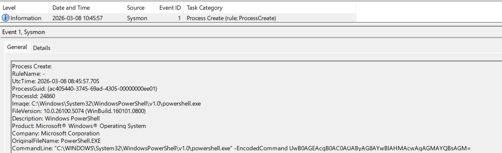
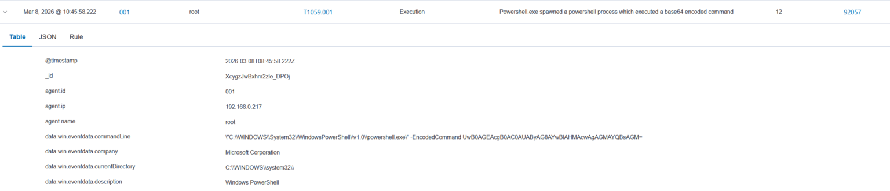
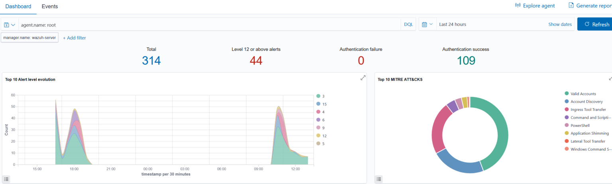

# Wazuh + Sysmon Detection Lab

## 1. Project Summary


This project demonstrates how Windows 11 Sysmon telemetry can be collected, analyzed, and correlated in Wazuh SIEM to detect suspicious PowerShell activity and related network behavior.

The lab focuses on:
- Sysmon process creation events
- Sysmon network connection events
- Wazuh alert generation
- basic log triage and detection validation
- MITRE ATT&CK mapping for observed activity

This project was built as part of my SOC / Blue Team learning journey to better understand how endpoint telemetry becomes actionable security alerts.

---

## 2. Objective

The goal of this lab was to simulate suspicious PowerShell execution on a Windows 11 endpoint, collect relevant Sysmon logs, forward them into Wazuh, and validate that the SIEM can detect and classify the activity.

Main objectives:
- generate observable PowerShell activity
- review Sysmon Event ID 1 (Process Creation)
- review Sysmon Event ID 3 (Network Connection)
- confirm alert visibility in Wazuh
- map the observed behavior to MITRE ATT&CK

---

## 3. Lab Environment

### Components used
- **Windows 11** endpoint
- **Sysmon** for endpoint telemetry
- **Wazuh agent** installed on Windows endpoint
- **Wazuh manager / SIEM** for log ingestion and alerting

### Example workflow
1. PowerShell command is executed on the Windows host
2. Sysmon records process creation telemetry
3. Sysmon records outbound network activity
4. Wazuh ingests the telemetry
5. Wazuh generates an alert based on the observed event data

---

## 4. Attack Simulation

In this lab, I executed PowerShell activity designed to generate visible telemetry for investigation and detection testing.

The test focused on:
- execution of `powershell.exe`
- suspicious command-line visibility
- outbound HTTP network connection initiated by PowerShell

This allowed me to validate whether the telemetry pipeline from endpoint to SIEM was working correctly.

---

## 5. Telemetry and Evidence

### PowerShell Execution



### Sysmon Event ID 1 – Process Creation

Sysmon captured the execution of `powershell.exe` together with its command-line arguments.

This event is useful because it shows:
- parent / child process context
- executable path
- command-line content
- execution timestamp



---

### Sysmon Event ID 3 – Network Connection

Sysmon also recorded a network connection initiated by PowerShell.

This event is important because it shows:
- source process
- destination IP
- destination port
- protocol used
- timestamp of the connection



---

### Wazuh Alert

Wazuh generated an alert based on the Sysmon telemetry, demonstrating successful ingestion and detection visibility inside the SIEM.

This confirms that:
- the endpoint was correctly sending telemetry
- Wazuh parsed the event data
- the activity became visible for analyst review



### Wazuh Event Details (JSON)

The raw event data collected by Wazuh provides detailed insight into the executed command.



This allows analysts to:
- inspect full command-line arguments
- identify suspicious parameters (e.g., encoded commands)
- validate detection accuracy

This level of visibility is critical for deep investigation and threat validation.

---

## 6. Advanced Analysis

### Encoded PowerShell Execution

This lab also includes an example of encoded PowerShell execution, which is commonly used for obfuscation.



Encoded commands are commonly used by attackers to evade detection and hide malicious intent.

---

### Sysmon Event ID 1 – Encoded Command

Sysmon captured the execution of an encoded PowerShell command, exposing the full command-line used during execution.



This provides visibility into:
- encoded payload execution
- process context
- command-line arguments used by the attacker

---

### Wazuh Event Details (JSON View)

Wazuh provides detailed event data including command-line arguments and process information.



This allows analysts to investigate:
- full command-line execution
- encoded payloads
- process context

---

## 7. SIEM Visibility

### Wazuh Dashboard Overview

The Wazuh dashboard provides centralized visibility into collected telemetry and alerts.



This allows analysts to:
- monitor alert trends
- identify suspicious activity
- correlate events across systems

This demonstrates how raw endpoint telemetry is transformed into actionable insights for SOC analysts.

## 8. Detection Logic

The core detection logic in this lab is based on identifying suspicious PowerShell execution and correlating it with endpoint telemetry collected by Sysmon.

Detection opportunities include:
- execution of `powershell.exe`
- suspicious or encoded command-line arguments
- PowerShell-initiated outbound network connections
- alert generation in Wazuh based on Sysmon event data

Example custom detection rules are available in the `rules/` directory.

---

## 9. MITRE ATT&CK Mapping

Observed activity in this lab aligns with:

- **T1059.001 – Command and Scripting Interpreter: PowerShell**

This mapping helps connect raw telemetry to a known attacker technique and improves triage context for analysts.

---

## 10. Key Findings

- Sysmon provides valuable endpoint visibility for process and network activity
- Event ID 1 and Event ID 3 are useful for investigating suspicious PowerShell behavior
- Wazuh can successfully ingest Sysmon telemetry and convert it into analyst-visible alerts
- Mapping alerts to MITRE ATT&CK improves detection context and reporting quality

---

## 11. Repository Structure

```
wazuh-sysmon-detection-lab/
├── analysis/
├── config/
├── rules/
├── screenshots/
└── README.md
```

## Folder description

- analysis/ – investigation notes and event interpretation

- config/ – configuration notes and related setup files

- rules/ – custom Wazuh detection rules

- screenshots/ – evidence from Sysmon and Wazuh

- README.md – project overview and findings


## 12. Skills Demonstrated

This project demonstrates:

- Windows event telemetry analysis
- Sysmon-based log investigation
- Wazuh alert review
- Basic detection engineering concepts
- MITRE ATT&CK mapping
- SOC-style documentation and evidence presentation


## 13. Future Improvements

Planned improvements for this lab:

- Add more custom Wazuh rules
- Include encoded PowerShell detection examples
- Expand screenshots and investigation notes
- Simulate additional Windows attack behaviors
- Improve alert triage documentation


## 14. How to Reproduce

Steps to reproduce this lab:

1. Install Sysmon on Windows 11 endpoint
2. Configure Sysmon to capture process and network events
3. Install and connect Wazuh agent
4. Execute PowerShell command to generate telemetry
5. Review Sysmon logs and Wazuh alerts


## Author

Created by Vitalijus Petrovas as part of a personal SOC / Blue Team portfolio.


